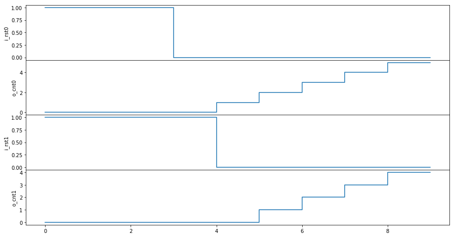

PyClk is a simple implementation of a Hardware Description Language (HDL) in Python. Industry standard HDLs are SystemC, Verilog and VHDL, but check out [MyHDL](http://www.myhdl.org) for a great Python package. Unlike these HDLs, the clock signal in PyClk is implicit and does not actually exist: calling `run()` makes the clock advance one cycle. This simplifies the implementation of PyClk and probably improves its performances, but it also makes your design clearer: a register is declared explicitly, and not infered from the way it is used. This implies that your whole design works with a single clock. Although multiple clocks might be supported in the future, you can already do a lot with one clock!

```python
import sys
sys.path.append('..')
from pyclk import Module, List, In, Out, Reg, Trace
```


```python
class counter(Module):
    def __init__(self):
        self.i_rst = In()
        self.o_cnt = Out()
        self.r_cnt = Reg()
    def logic(self):
        # logic goes here
        if self.i_rst == 1:
            self.r_cnt = 0
        else:
            self.r_cnt = self.r_cnt.q + 1
        self.o_cnt = self.r_cnt.q

class toplevel(Module):
    def __init__(self):
        # declare signals, registers, I/Os
        # instanciate sub-modules and make connections
        self.i_rst = List()
        self.o_cnt = List()
        self.u_counter = List()
        for i in range(2):
            self.i_rst[i] = In()
            self.o_cnt[i] = Out()
            self.u_counter[i] = _ = counter()
            _.i_rst(self.i_rst[i])
            _.o_cnt(self.o_cnt[i])
    def task(self): # a task can be hooked to the module
        while True:
            yield self.wait(2) # wait for 2 clock cycles
            print(f'Time is {self.time}')
```


```python
u_toplevel = toplevel()

trace = Trace()
for i in range(2):
    trace.add(u_toplevel.i_rst[i])
    trace.add(u_toplevel.o_cnt[i])

u_toplevel.i_rst[0] = 1
u_toplevel.i_rst[1] = 1

u_toplevel.run(3, trace=trace)

u_toplevel.i_rst[0] = 0

u_toplevel.run(trace=trace)

u_toplevel.i_rst[1] = 0

u_toplevel.run(5, trace=trace)

trace.remove(u_toplevel.o_cnt[0])

u_toplevel.run(5, trace=trace)

trace.add(u_toplevel.o_cnt[0])

u_toplevel.run(5, trace=trace)
```

    Time is 2
    Time is 4
    Time is 6
    Time is 8
    Time is 10
    Time is 12
    Time is 14
    Time is 16
    Time is 18


```python
trace.plot()
```


